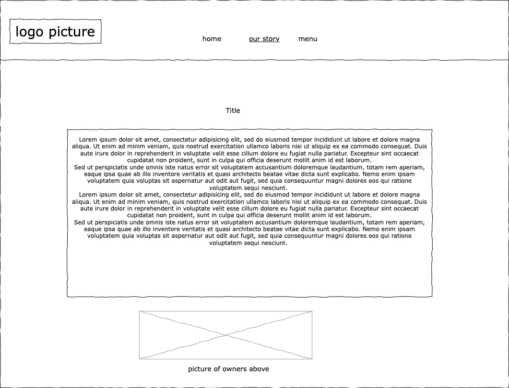

# Lydia Jarvis Project 1

## Description
Mamaka is a little up and coming smoothie bowl joint with amazing options that you can mix and match with! This website shows some of what they have to offer, along with the beautful duo who made this happen, and our menu that you can look over & fall in love with while also having your order ready before you even arrive! Press on the labels (home, our story, instagram, and menu) to see what we offer!

### Wireframes

### Technologies used:
- Html
- CSS
- Google fonts
- Bootstrap
- Draw.io
- Color picker
- Remove.bg
- W3 Html checker

### User Stories:
- As a user, I want to be able to scroll the pictures to see what they could offer
- As a user, I would like to be able to press the menu button and see options
- As a user, I would like to fill out a form to be updated with news and alerts

### Rooom for improvement:
- I would like to add more pictures and get more familiar with columns and rows
- I would like to work with javascript more and add that alement into it 
- I would like to add a searcg bar that people can use to navigate my website easier 
- Also, I would like to add more of what we offer (like apparael)
